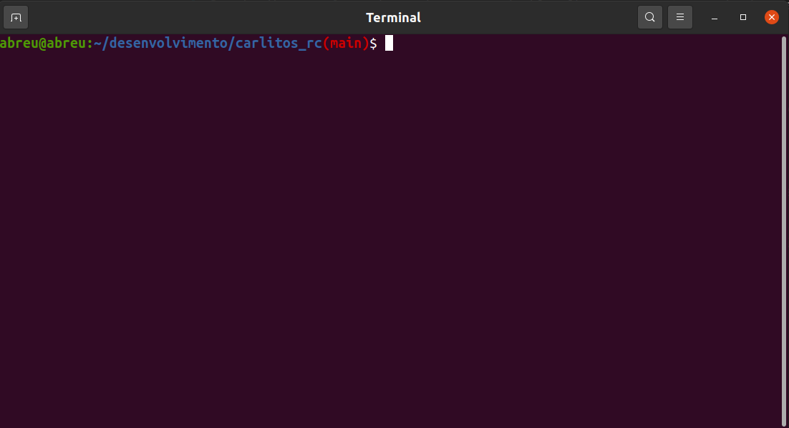

# **carlitos_rc**
Arquivo para complementar o bashrc no linux e o zshrc no MAC. Sim, sim, eu entendo que isso é muito pessoal e que cada programador gosta de ter o seu. Por isso, sinta-se a vontade para testar e modificar como achar melhor.


Estas configurações de shell estão sendo usadas com: 

    MacOs Catalina 10.15.7 com o zsh
    Ubuntu 20.04.1 LTS 64 Bits com o bash

Para saber qual o shell no seu computador, utilize o comando:

    echo $SHELL

## **Como configurar?**

Passo 1: Copiar o arquivo

A primeira coisa a fazer é copiar o arquivo .carlitos_rc deste projeto para a sua home (~). Podemos fazer isso de várias maneiras e aqui vão 3:

1) Curl:
```
curl https://raw.githubusercontent.com/carlosabreu/carlitos_rc/main/src/.carlitos_rc --output ~/.carlitos_rc
```

2) Wget:
```
wget -O ~/.carlitos_rc https://raw.githubusercontent.com/carlosabreu/carlitos_rc/main/src/.carlitos_rc
```

3) Clonar o repositório e copiar o arquivo:
```
1) Abra um terminal e entre na pasta que você deseja ter o repositório.
2) Clone o repositório: git clone https://github.com/carlosabreu/carlitos_rc.git
3) Entre na pasta: cd carlitos_rc
4) Copie o arquivo src/.carlitos_rc para a sua pasta home (representada por ~): cp src/.carlitos_rc ~  
```

Passo 2: Chamada

O próximo passo, consiste em adicionar a chamada para arquivo carlitos_rc no seu arquivo de configuração do shell:
    
MAC:
```
echo "\n\nif [ -f ~/.carlitos_rc ]; then\n     . ~/.carlitos_rc\nfi" >> ~/.zshrc
```

LINUX: 
```
echo -e "\nif [ -f ~/.carlitos_rc ]; then\n     . ~/.carlitos_rc\nfi" >> ~/.bashrc
```


Pronto, quando abrir um novo terminal ou uma nova aba, este utilizará estas novas configurações.

## **Como utilizar?**

### **Python server**
Normalmente, o mac e o linux já vem com o python instalado. No python 3 para subir um servidor compartilhando determinados arquivos de uma pasta basta rodar um único comando:
    
    python3 -m http.server

Depois disso você precisa rodar o comando ifconfig para encontrar o ip da sua máquina para passar para alguém em outra máquina acessar. Com este alias, você faz isso com apenas um comando:

    server

### **Ctrl S**
Quem utiliza mac ou linux há algum tempo sabe como é bom o atalho ctrl + r. Com ele você consegue buscar comandos dentro do seu histórico, não um a um, mas digitando o comando que você quer. Exemplo:

    Aperto: ctrl + r
    Digito: ser 
Há grande chances de que seja encontrado o comando server. Se não for a primeira opção, aperto ctrl + r novamente que ele vai pro próximo. Legal né?

Mas e se durante essa busca, depois de apertar algumas vezes o ctrl + r eu tiver passado do comando que eu queria?
Bem o carlitos_rc habilita o ctrl + s para que você possa voltar. 

### **Nome da branch no git**
Apresenta o nome da branch no terminal e deixa-o colorido. Fica assim:



Sim eu sei, esse é o mais controverso de todos, pois cada desenvolvedor gosta de ter o terminal do seu jeito.
Como eu disse no início, faça sua própria personalização.

### **split_grep**
O comando grep é um excelente comando para realizar buscas em pastas e em arquivos. Exemplo de utilização:

    grep -Inri git .
    grep -Inri git . > arquivo.txt

O primeiro mostra o resultado no terminal, enquanto o segundo coloca este resultado em um arquivo chamado arquivo.txt

No entanto, já tive situações em que o arquivo tinha tantas linhas que os editores de texto tinham dificuldades em abrí-lo. Para isso criei o split_grep. Que nada mais faz do que dividir a resposta em arquivos respeitando o número máximo de linhas por arquivo.

    split_grep "git" 50

### **kill_by_name**

O último script tem como motivação o sistema travando. Com quem nunca aconteceu de estar usando o app e algum programa travar? Neste cenário, quando algum terminal ainda funciona, é possível utilizá-lo para encerrar o programa que está travado. Por exemplo, se acontecer com a steam:

    ps -aux | grep steam 

Isso irá listar todos os processos que tem steam no nome. Para encerrá-lo, deve-se utilizar o comando: 
    
    kill -9 numero_do_processo

Porém pode haver vários processos com o nome steam (no caso esta function irá encerrar todos). Para isso, utilize:

    kill_by_name steam

## **Retirando o arquivo carlitos_rc:**

Não gostei desse arquivo, como faço pra tirá-lo do meu computador.

    rm -rf ~/.carlitos_rc


## **Conclusão:**

Neste tutorial aprendemos como configurar um arquivo próprio de shell, sem alterar o arquivo que vem com o sistema, deixando suas configurações separadas de modo a ser mais facilmente copiado para outro computador.

Este arquivo é bastante útil pra mim e por isso resolvi compartilhar. Espero que seja útil pra você também. Leia com bastante atenção este README e a documentação no próprio arquivo e faça testes pequenos. Eu não me responsabilizo por mau uso desses scripts.